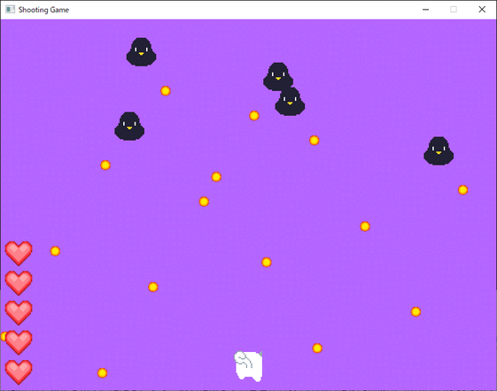

# ShootingGame

## Overview

ジャンル：2Dドットシューティング

種別：フリーウェア

使用ライブラリ：[SDL](https://www.libsdl.org/)、[Game Programming in C++ Code](https://github.com/gameprogcpp/code)

## How to start

「ShootingGame.exe」を実行してください。

## How to play

- 矢印キー(←→)：移動

- Space：レーザー発射

- Esc：ゲーム終了

## License

Copyright (c) 2022 mthr11

当ソフトに使用している素材やデータ等にはすべて著作権があります。素材やデータ等の改造、転載及び流用、二次配布等を禁止します。ただし、フリー素材に関しては各著作者の利用規約に従えば使用可能な場合があります。

当ソフトの利用にあたって、何らかの不具合やトラブルが生じたとしても、mthr11は一切の責任を負いません。自己責任でご利用ください。

## Credits

**画像素材**

- Kiti様

  サイト：[JunkPixel](https://junkpixel.com)

- ぴぽや様

  サイト：[ぴぽや倉庫](https://pipoya.net/)

- hiropon様

  サイト：[ニコニ・コモンズ](https://commons.nicovideo.jp/user/644065)

- サイト：[ゲームクリエイタ科の先生がなんかやる](http://yamamototaro.blogspot.com/)

## Reference

- マドハブ・サンジャイ「ゲームプログラミング C++」吉川邦夫訳, 今給黎隆監修, 翔泳社, 2020
